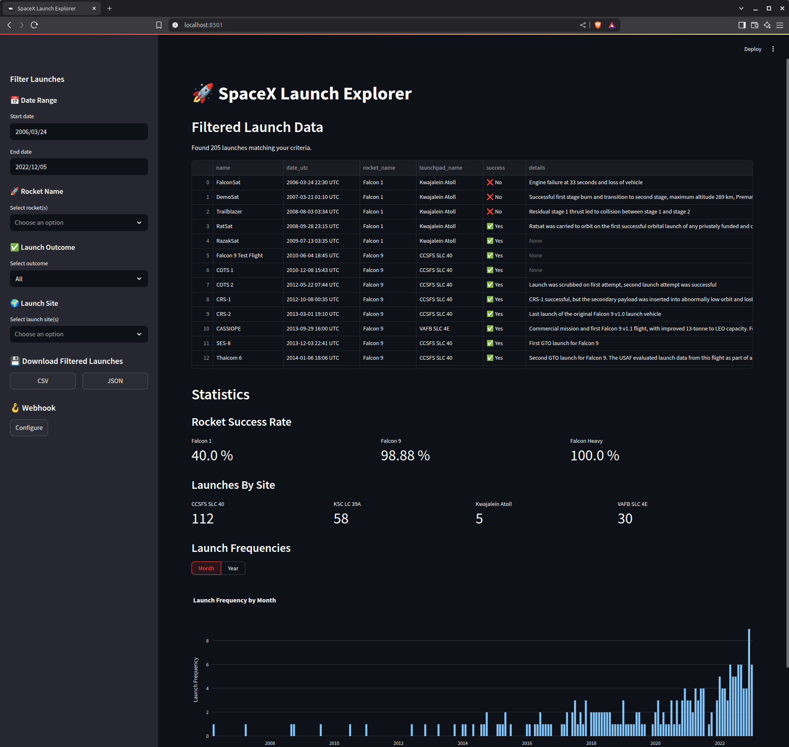
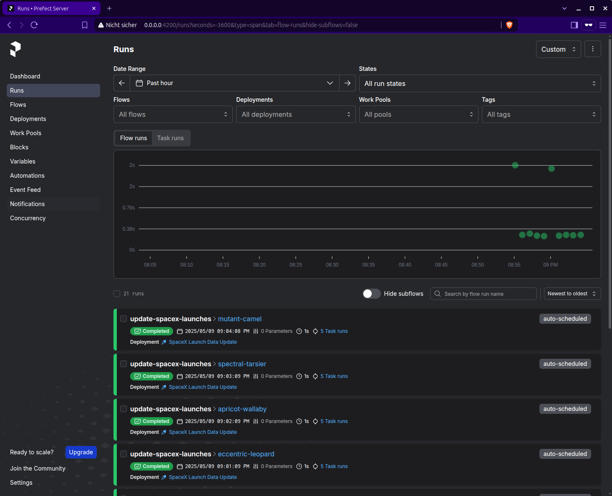

# 🚀 SpaceX Launch Tracker
[](https://www.docker.com/)
[](https://www.prefect.io/)
[](https://www.mongodb.com/)
[](https://streamlit.io/)
[](https://www.python.org/downloads/)

This application leverages the public [SpaceX API (v4)](https://github.com/r-spacex/SpaceX-API/blob/master/docs/README.md) to provide robust launch tracking and analysis. Developed as a solution to a coding challenge, it features periodic data synchronization orchestrated by Prefect, persistent storage in MongoDB, and an interactive user interface built with Streamlit.

## Features

*   **SpaceX Data Collection & Transformation:**
    *   Periodically fetches launch, rocket, and launchpad data from the public SpaceX API (v4).
    *   Transforms and stores this data in a denormalized format within MongoDB for efficient querying and analysis.
    *   The data collection workflow uses Prefect's caching mechanism to minimize redundant API calls, especially beneficial during development.

*   **Interactive Streamlit UI:**
    *   Provides a user-friendly web interface for exploring SpaceX launch data.
    *   Allows users to display a list of all launches with key details and apply filters based on date range, rocket name, launch success/failure, and launch site.
    *   Dynamically calculates and visualizes key statistics for the filtered launch data, such as success rates by rocket, total launches per site, and launch frequency over time.

*   **Webhook Notifications for New Launches:**
    *   Allows users to configure a webhook URL through the Streamlit UI.
    *   Upon detection of a new launch, a notification is sent to the configured webhook URL.

## Tech Stack & Architecture

*   **Data Collection:** **Prefect** for periodically fetching data from the SpaceX API and storing it in MongoDB.
*   **Database:** **MongoDB** for persistent storage.
*   **User Interface:** **Streamlit** for an interactive web interface to view and filter data.
*   **Containerization:** **Docker & Docker Compose** to manage and run all services.
*   **Language:** Python 3.12+
*   **Testing:** Pytest

## Prerequisites

*   Docker and Docker Compose
*   Git
*   Python 3.12+ and `pip` (for running tests locally)

## Setup and Running

1.  **Clone the repository:**
    ```bash
    git clone https://github.com/mpmX/spacex_launch_tracker.git
    cd spacex_launch_tracker
    ```

2.  **Run the Application:**
    ```bash
    docker compose up -d
    ```
    This starts:
    *   Prefect Server: `http://0.0.0.0:4200`
    *   MongoDB
    *   `data-sync` service
    *   Streamlit UI: `http://localhost:8501`


3.  **Stop the Application:**
    ```bash
    docker compose down
    ```
    To remove data volumes: `docker compose down -v`

## Running Tests Locally

1.  **Set up a virtual environment and install dependencies:**
    ```bash
    python -m venv .venv
    source .venv/bin/activate
    pip install -r requirements.txt
    ```

2.  **Run tests:**
    ```bash
    python -m pytest
    ```

## ❗Important Note on API Data

Please be aware that the public [SpaceX API (v4)](https://github.com/r-spacex/SpaceX-API/blob/master/docs/README.md) used by this application may not be up-to-date with the latest launch information. At the time of development, observations suggested that the most recent launch data available through the API was from 2022. This application will reflect the data as provided by the API.

## Screenshots
Launch Explorer UI


Prefect UI showing that cache is working (Collects every minute with a cache expiry of 5 minutes.)

